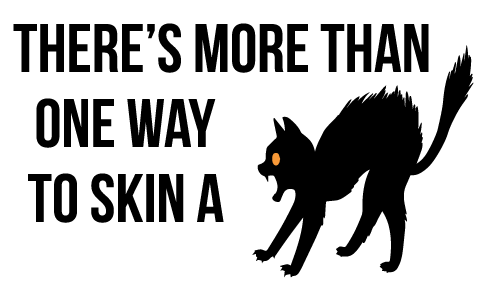
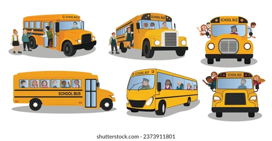

<h1>Philosophy of the Way Forward</h1>

<h2>Cats: There is a Lot of Different Ways to Go About Them</h2>

The funniest analogy I’ve heard is, “There’s more than one way to skin a cat”. The poor cats; I first heard this during a class on cyber security and have used it ever since. The idea is that there are multiple ways to do the same thing. When working on different projects with different groups, I run into this a lot. Everyone has different ideas on how to tackle a problem or design a system. But then, if there are all these options, which one do we go with?

<h2>Design Disorganization: One for None and All for All</h2>

When none of the options are chosen, all the options are chosen. I saw this when I worked on tackling the lack of clear directions in the state government of Hawai’i Office of Enterprise Technology’s disorganized project verification reporting system. There’s many different ways to make a report on something. I know there are at least as many different ways as there are projects the state is reporting. There are drastically different styles in reporting from each project to project. Individually, each reporting is fine. But trying to look across projects becomes a nightmare due to different designs chosen.

<h2>Wheels on the Bus: Same Song and Dance to a Different Tune</h2>

Well luckily in tackling problems, there’s no need to reinvent the wheel. When working on building a tool for someone else to use, the goal is to make the tool best suited for them. The goal isn’t to be the most innovative about how to build the tool. Other people have built lots of different tools. While the tool directly may not be related at all, the process of making it can be similar. Like, even though everyone has their own way of learning, there are broad categories of learning styles like visual, auditory, or kinesthetic. These existing design patterns can be used as a way to inform on how to tackle a problem.

<h2>Designing In Action: Standardizing State Reports</h2>

So when working with my team on standardizing the state’s reporting system, we made sure to clearly lay out how we were building with the goals of being scalable, reusable, and organized. Instead of having each report be individually scattered about, we had each project be an umbrella over all the related reports. This allowed us to be able to centralize previous scattered information like the overarching timeline for the project. Then each report would instead focus on detailed updates, like monthly project expenditures. Having this design idea of an umbrella gave us guidance on how we were building and designing this organization system.

