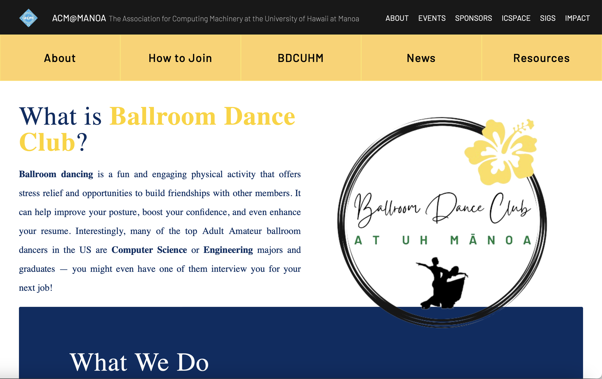
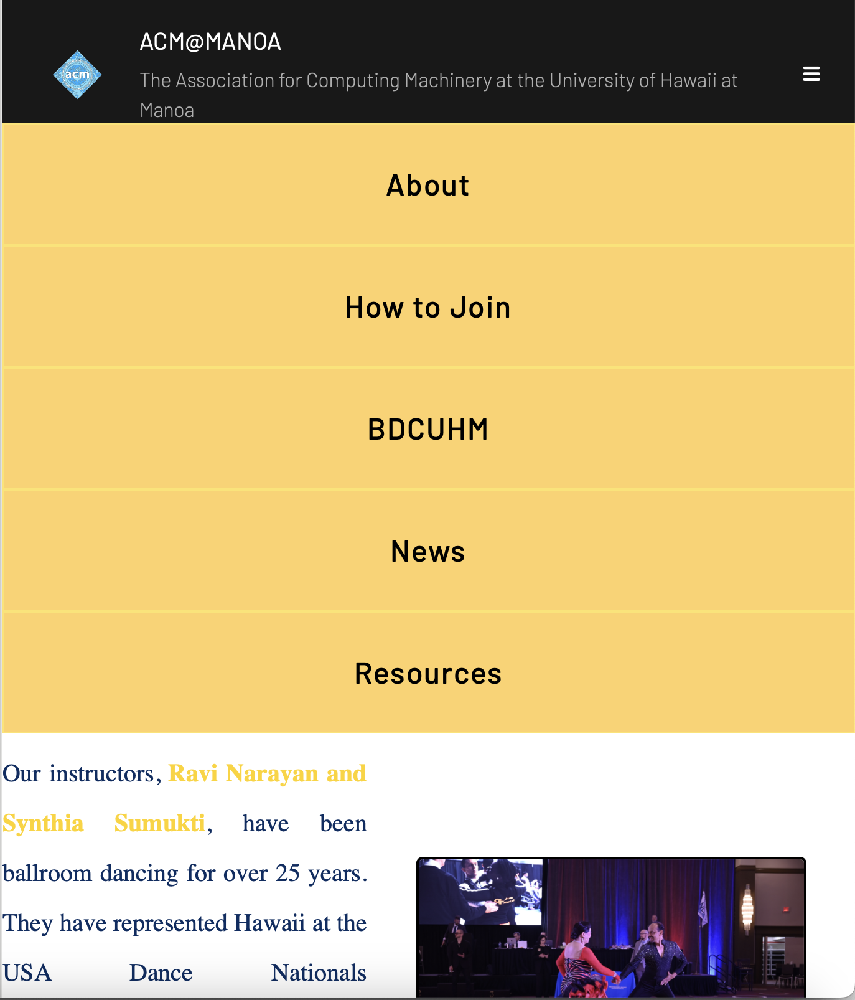

<h1>What I See and What You Get</h1>

When first building a website using the purest forms of just html and css, it's easy to spend hours tweaking the margins and padding numbers until the website looks perfect. 

But as soon as window size is changed even a little, everything starts to get out of whack. 

The first time I tried making a website was with a team of others who were all working on their own computers. We would all be tweaking the website's designs by changing the numbers to get the site to look just right. But as soon as we looked at it on another persons screen, everything looked awfully dispropotionate. No matter how many hours we spent tailoring the website to one screen, on the next it looked off once again.

<h1>UI Frameworks</h1>

It wasn't until we tackled the issue from a different angle that we were able to solve the scaling problem. Instead of trying to get every number just right, we started leveraging UI Frameworks like bootstrap or tailwind to design websites. UI Frameworks allowed us to leverage prexisting designed components and modify them to our needs instead of building them from scratch. It was also easier to figure out the modifications being made to the design too. The consistent naming schemes inside the html elements helped point to exactly what was getting changed and how instead of flipping between the css and html files. This allowed us to develop much faster together and to be able to put our efforts into the overall user interface design elements rather than the details of the reponsiveness of the website.
