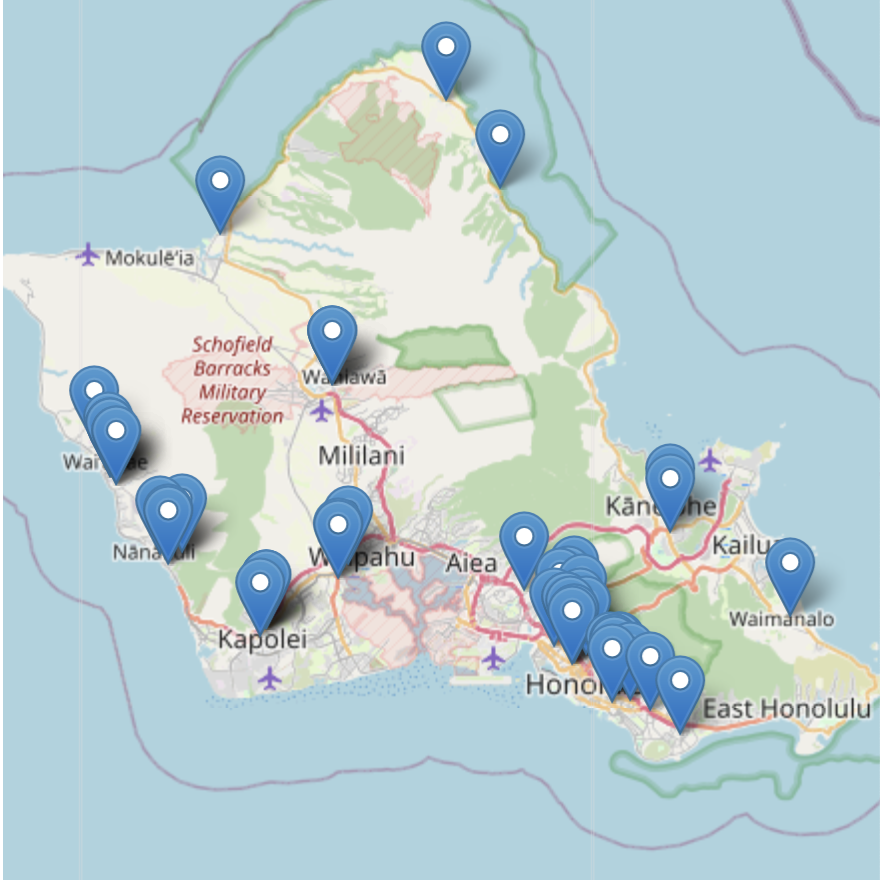
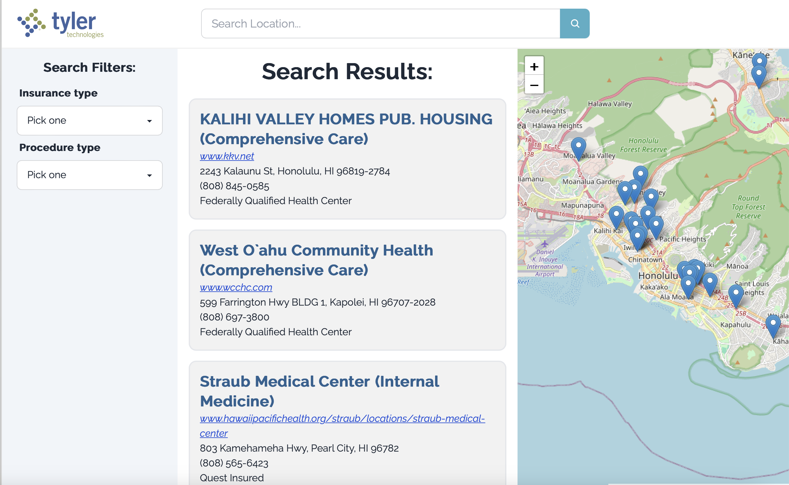

-

A website for those without health insurance to help them find the best affordable healthcare they need. My team developed for the Tyler Hawai'i during the 2023 Hawai'i Annual Coding Challenge

I researched the nature of the problem to lay out the overall design of the website. My team and I weren't familiar with health insurance policies when uninsured, so first I worked on figuring out how to find available clinics, what information is useful, and what information is available. Once the initial research was done, I laid out how the user would interact with the site and made mockups of the pages. I worked mainly on the user interface of the website, particularly the design of the home page, search page, and clinic information pages. Throughout the development process, as questions on the design would come up from my team, I would be the point of contact to reach out to learn more about what the ideal final design would be for the end user. 

 
Source: <a href="https://mhshakk.vercel.app">HelpCare</a>
