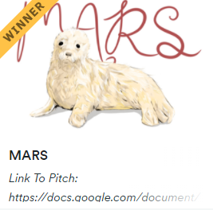
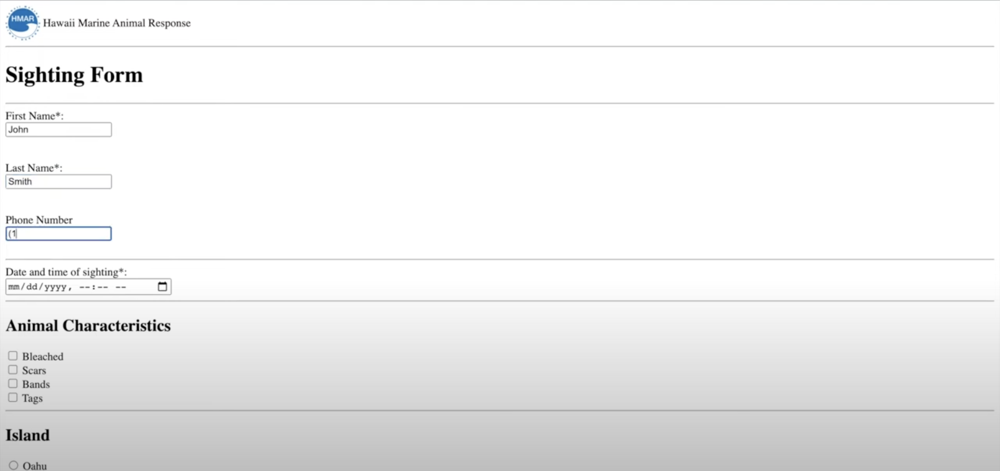

-

A marine animal rescue sighting web page my team developed for the Hawai'i Marine Animal Response during the 2021 Hawai'i Annual Coding Challenge

I worked on creating the reporting forms. This was my first time using HTML, CSS, or Javascript. So a lot of the project was spent learning how to create basic tables, make forms, and change sizes.
 
Source: <a href="https://devpost.com/software/mars-fgq4xs">Marine Animal Rescue Sighting</a>
