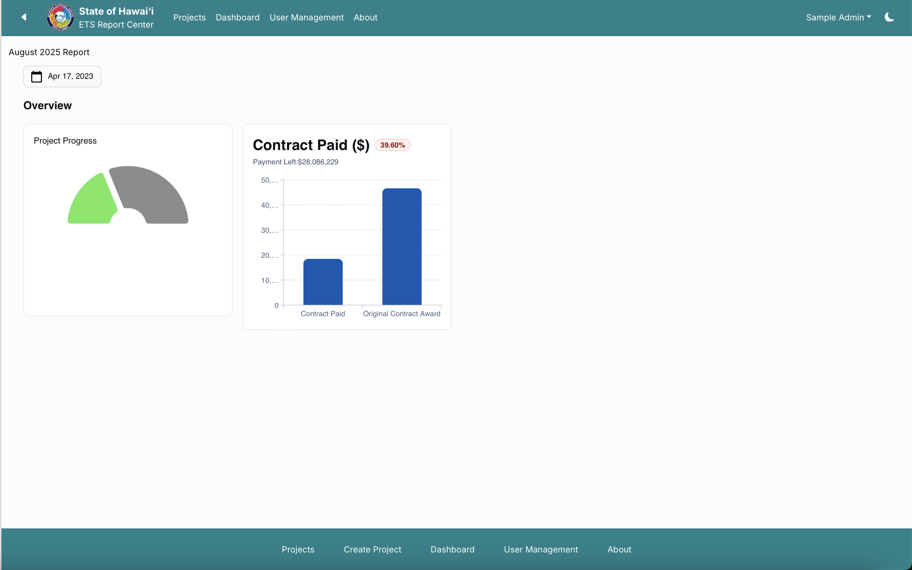

-

A standardization of the State of Hawaii's Independent Vendor and Verification Reports. The State of Hawaii has many ongoing projects with outside vendors validating the progress of the projects. However the way that each vendor goes about reporting is different from the next. The reports are centralized to some extent on the State of Hawaii Enterprise of Technology Services website. All the reports are there, however they are listed in drop down menus in pdf format. 

So I worked with a team to create a standardized reporting system to make the information more consistent and understandable to the public, vendors, and state. I worked on the reports themselves. I created a layout for each of the graphs that the reports are made out of and connected them to our reports database to create the reports from the data with no extra effort. 
 
Source: <a href="https://oh-yeah-ics-314-final-project-7-lets-go.github.io">About the Standardized Reporting Website</a>

Source: <a href="https://pseudo-hacc-ets.vercel.app">Live Standardized Reporting Website</a>

