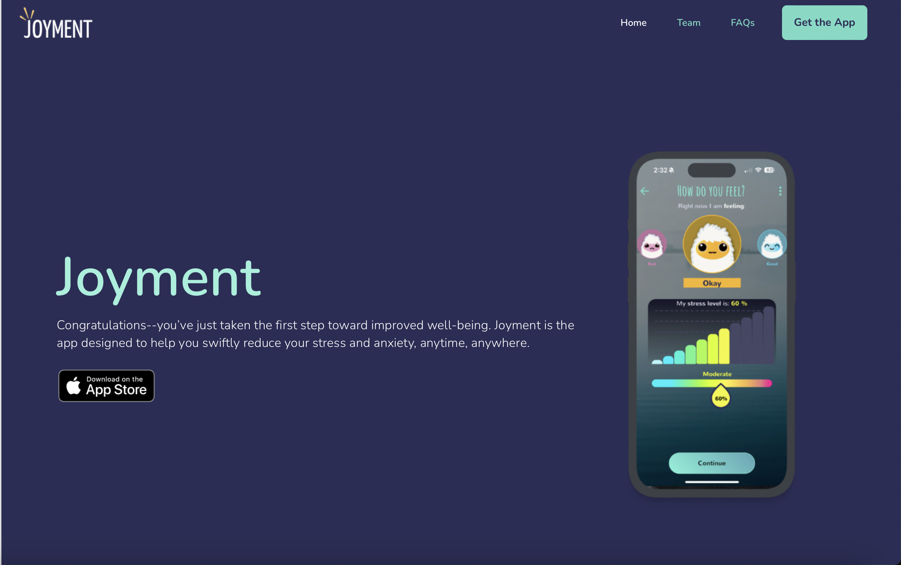

-

I redesigned the Resilient Moments promotional website in preperation of the launch of their app, Joyment.

I was the sole website developer working with the marketing director and the design team to overhaul the website. The branding for the company had changed since the initial development of the app. I worked on adding pages such as the team page, FAQs, privacy policy, and terms and conditions. On the home page, I redesigned the layout to better highlight the strengths of the app as well as include user testimonials. This was my first time being the only developer, so I learned a lot through the entire development process. I worked on every part of the website from start to finish and was in contact with marketing and design teams directly.
 
Source: <a href="https://resilientmoment.com">Resilient Moments: Joyment</a>
